# Cesi2
Tp Cesi

powershell

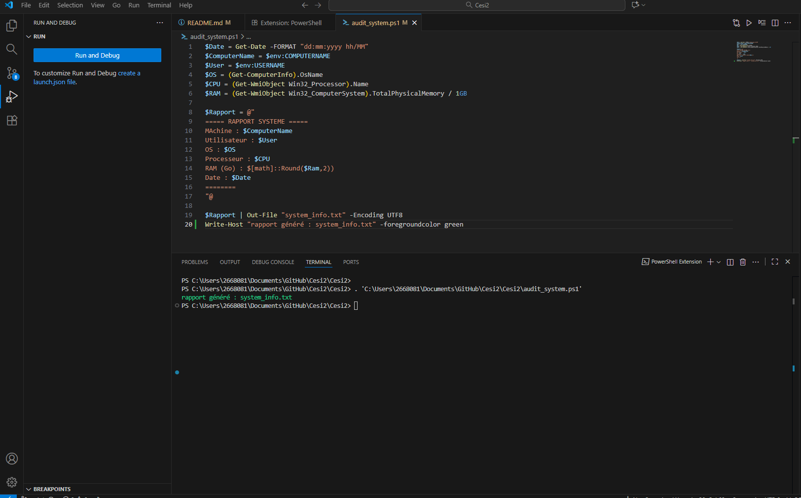

server ad carte reseau

Ad + DNS + DHCP

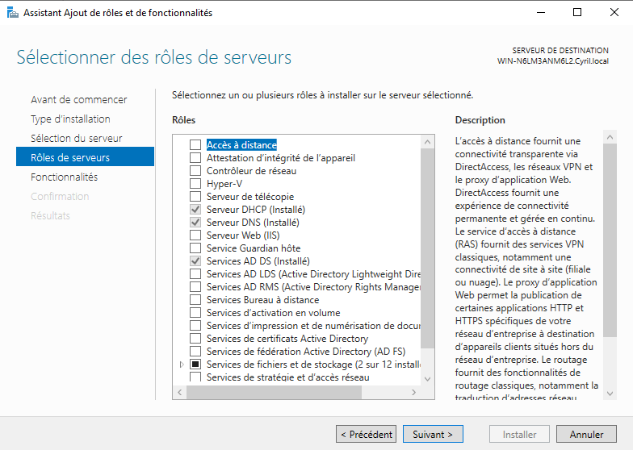

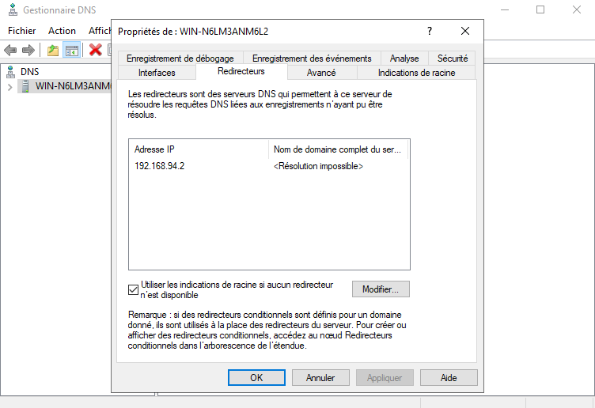

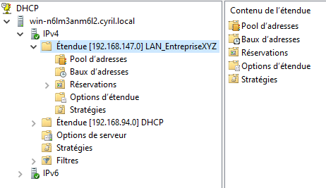

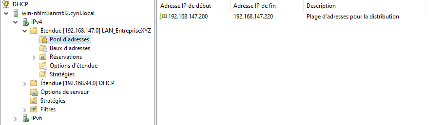

Zone primaire DNS

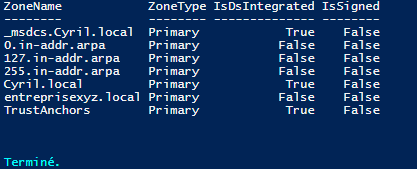

Réservation poste administratif

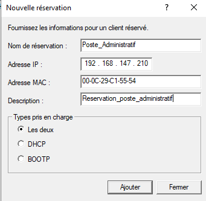

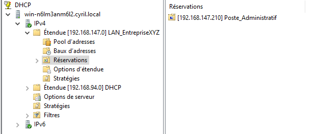

Questions :
- Quelle est la différence entre une adresse IP dynamique et une réservation DHCP ?

L'adresse IP dynamique est automatiquement distribué sur la plage d'IP donné par le DHCP et change à chaque connexions
alors que une réservation DHCP se voit affecter une adresse IP fixe grâce à son adresse MAC.

- Quelle commande permet de vérifier la liste des zones DNS existantes ?

C'est la commande Get-DnsServerZone.

- Pourquoi utiliser un redirecteur dans un DNS d’entreprise ?

On utilise un redirecteur pour sécuriser, controller et améliorer les résolutions DNS extérieurs
sans exposer le DNS interne.

Compte utilisateur+groupe+unité d'organisation
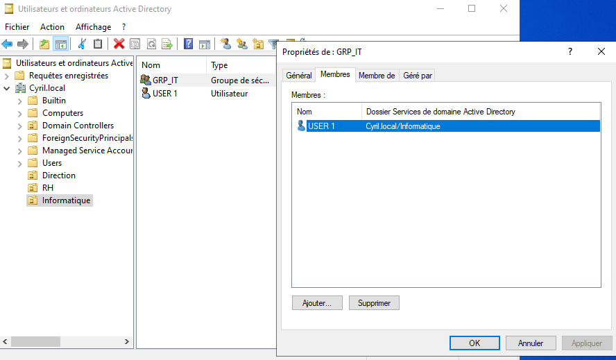

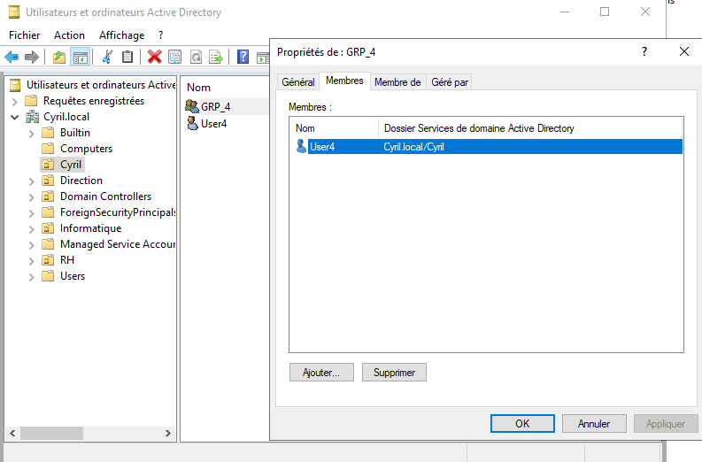

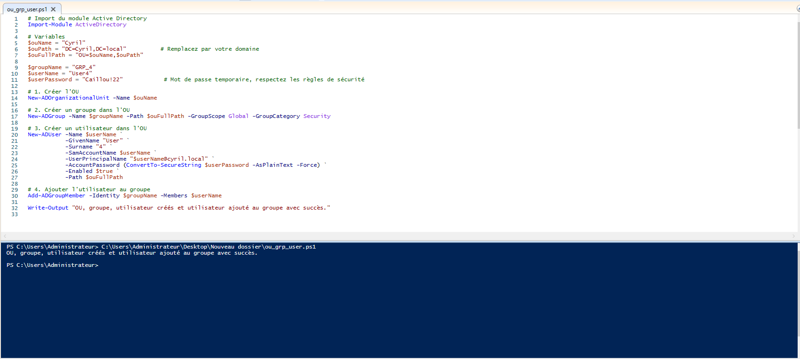

computer sur ad

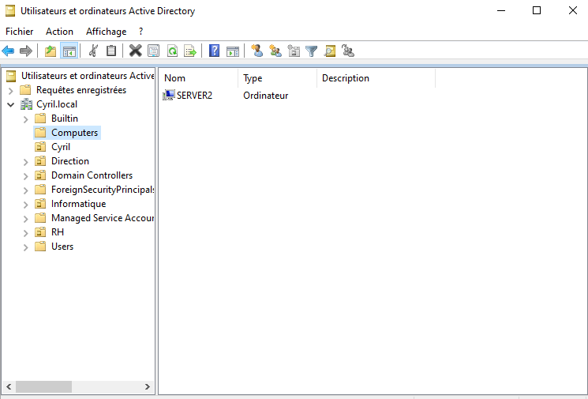

powershell

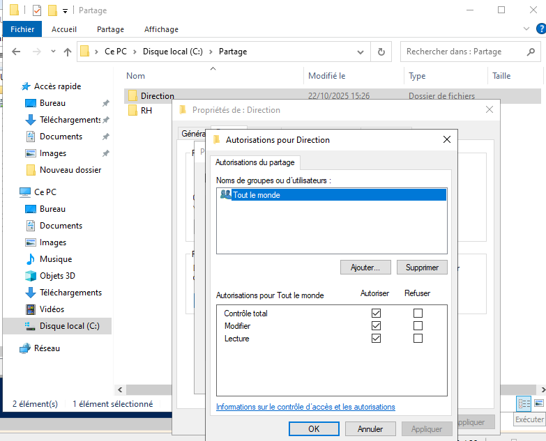

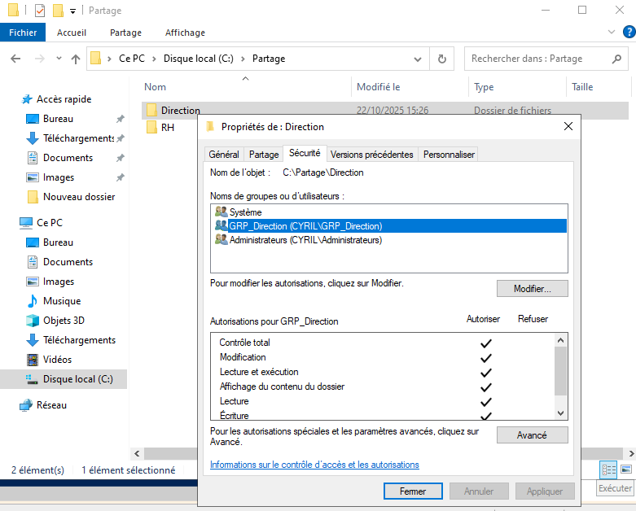

partage fichier

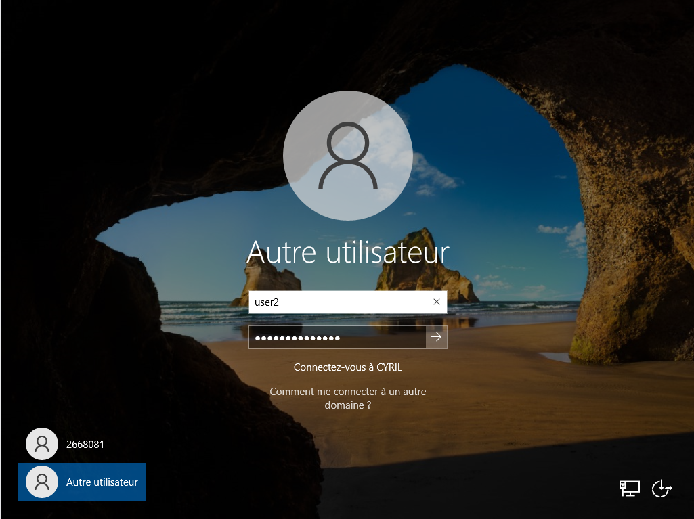

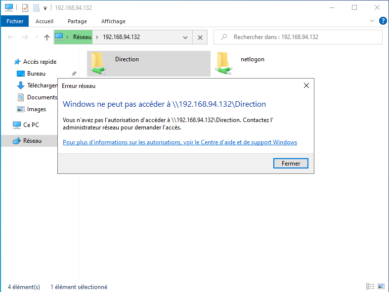

Bureau à distance :

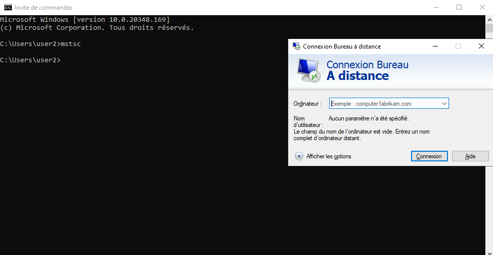

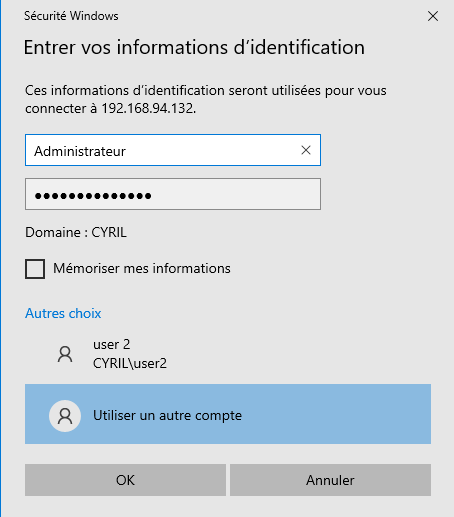

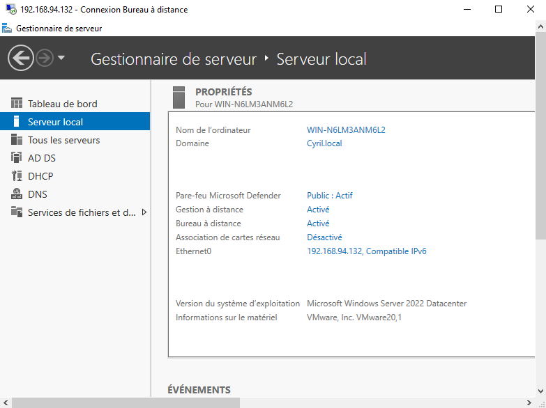

