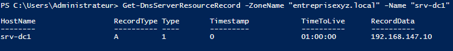
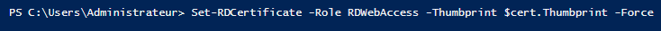

# CESI 2
#Tp Cesi powershell

Server ad carte reseau

Ad + DNS

Compte utilisateur+groupe+unité d'organisation

Computer sur ad

Partage fichier

Bureau à distance :

Zone primaire DNS

1. Créez une zone primaire DNS nommée entreprisexyz.local.

2. Ajoutez un enregistrement hôte (A) pour le serveur principal :
 - Nom : srv-dc1
 - IP : 192.168.147.10

3. Configurez un redirecteur DNS vers les serveurs publics de Google :
 - 8.8.8.8
 - 8.8.4.4

Questions :

- Quelle est la différence entre un enregistrement A et un CNAME ?

Enregistrement A : associe un nom de domaine directement à une adresse IP.
Enregistrement CNAME : crée un alias pointant vers un autre nom de domaine déjà existant (qui lui a un A record).

- Quelle commande permet de vérifier la liste des zones DNS existantes ?

C'est la commande: Get-DnsServerZone

- Pourquoi utiliser un redirecteur dans un DNS d’entreprise ?

- Pourquoi utiliser un redirecteur dans un DNS d’entreprise ?

On utilise un redirecteur pour sécuriser, controller et améliorer les résolutions DNS extérieurs
sans exposer le DNS interne.

DHCP :

création de l'étendue :

On utilise cette commande, pour avoir la liste des étendues :

Voici ce que ça donne:

On utilise après cette commmande pour voir le nom de domaine, le DNS et le Routeur :

Ce que ça donne :

On utilise après cette commande pour créer la réservation :

On utilise après cette commande pour bien vérifier la réservation :

Questions :
- Quelle est la différence entre une adresse IP dynamique et une réservation DHCP ?

L'adresse IP dynamique est automatiquement distribué sur la plage d'IP donné par le DHCP et change à chaque connexions
alors que une réservation DHCP se voit affecter une adresse IP fixe grâce à son adresse MAC.

- Que se passe-t-il si deux serveurs DHCP répondent sur le même réseau ?

Les clients peuvent recevoir des adresses IP de l’un ou l’autre serveur, ce qui peut provoquer des conflits d’adresses ou des problèmes de connectivité.

- Quelle commande PowerShell permet de visualiser les baux DHCP actifs ?

C'est la commande : Get-DhcpServerv4Lease -ScopeId <ScopeId>

Bureau à distance :

On utilise d'abord cette commande pour vérifier que tout les rôles sont disponibles :

On utlise après cette commande pour installer tout les rôles nécessaires pour le service Bureau à distance et mettre restart à la fin pour redémarrer automatiquement si besoin :

- Install-WindowsFeature -Name RDS-RD-Server, RDS-Web-Access, RDS-Connection-Broker -IncludeAllSubFeature -IncludeManagementTools -Restart

Après le redémarrage on vérifie que tout les rôles soient bien installés:

On utilise après cette commande pour le FQDN :

Une fois le FQDN obtenu on l'utilise dans la commande suivante pour effectuer le déploiement :

On utilise après cette commande pour vérifier que le déploimenet à été effectué :

Tout à été bien installé pour le bloc note : 

Pareil pour la calculatrice :

On crée après le certificat auto signé : 

On sécurise après le certificat : 

et on vérifie après que le certificat à bien été fait : 

On essaye ensuite de se connecter sur le site pour être bien sûr que la sécurisation a été faîte :

On a bien accès aux ressources avec la calculatrice et le bloc note :

